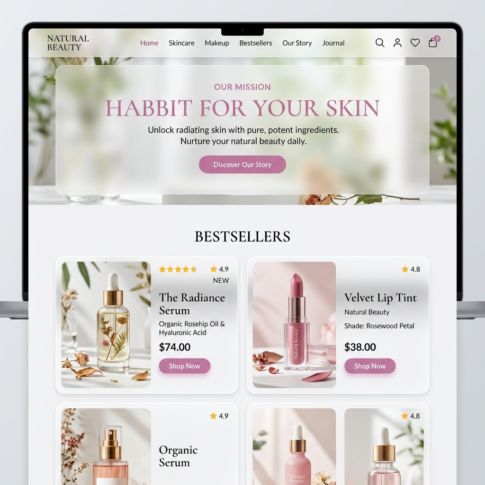

# Natural Beauty - Cosmetics & Skin Care E-Commerce System

## 📌 Project Overview
**Natural Beauty** is a premium, fully responsive, and feature-rich online cosmetics and skin care e-commerce web application. Designed to deliver an immersive and luxury shopping experience, the platform enables users to discover, filter, and buy premium skin care products, makeup, and perfumes. 

The application is built using a highly optimized stack combining **PHP** for robust server-side business logic, **MySQL** for high-performance relational database management, **Vanilla JavaScript (ES6+ / AJAX)** for seamless asynchronous page interactions, and **Tailwind CSS** for a breathtakingly modern, custom-designed user interface.

---

## 🚀 Technologies Used
The system is built using modern web development standards and a custom architecture for speed, security, and aesthetics:

- **Frontend & Styling**: 
  - **HTML5 & CSS3** for semantic layouts.
  - **Tailwind CSS (v3.x)** with Custom Configs for a premium glassmorphic visual aesthetic, custom typography, soft rose gradients, and smooth transition animations.
  - **Google Fonts** (Lobster, Inter, Outfit) for elegant modern typography.
- **Client-Side Logic & Dynamic Interactions**:
  - **Vanilla JavaScript (ES6+)** for structured frontend event handling.
  - **Asynchronous AJAX (XMLHttpRequest)** to achieve quick, non-page-reloading content updates for search, cart operations, watchlist management, and status changes.
- **Backend & Server-Side Logic**:
  - **Native PHP** for robust session management, database interactions, secure data processing, and user request routing.
- **Database Management**:
  - **MySQL** relational database with custom index optimizations.
  - **PHP Object-Oriented MySQLi Extension** for high-security, fast-executing database queries.
- **Secure Email Services**:
  - **PHPMailer (v6.x)** with SMTP integration for secure and reliable dispatching of password recovery verification codes.

---

## ✨ Features

### 👤 Customer-Facing Features
- **Modern Responsive Design**: A fluid grid layout optimized for desktops, tablets, and smartphones using advanced Tailwind breakpoint utilities.
- **Dual-Mode Search System**:
  - **Instant Live Search**: Quick search that queries the database in real-time as users type.
  - **Advanced Multi-Criteria Search & Filter**: Filter by Category, Brand, Model, Color, and an interactive Price Range slider with instant dynamic product loading.
- **Secure Authentication & Identity**:
  - Comprehensive Sign Up and Sign In system with strict email, mobile, and password validation.
  - "Remember Me" security cookie management.
  - Asynchronous email-based **Forgot Password** process sending unique SMTP verification codes via PHPMailer.
- **Interactive Shopping Cart**: AJAX-driven cart that allows users to add/remove products, adjust quantities, and instantly view updated totals and sub-totals without page reloads.
- **Personalized Watchlist (Wishlist)**: A dedicated wishlist where customers can save their favorite cosmetics for future purchases.
- **Custom Profile Management**: A personalized profile page allowing customers to update delivery details (address lines, city, postal code), gender, and upload custom avatars (profile pictures).
- **Secure Checkout & Dynamic Invoicing**: Automated checkout processing that deducts inventory stocks, saves transaction history, and generates viewable/downloadable digital purchase invoices.

### 🛡️ Administrator-Facing Panel
- **Administrative Portal & Secure Login**: A protected authentication gate dedicated to store managers.
- **Analytics Dashboard**: Real-time analytical counters showing total sales, user sign-ups, and stock movements.
- **Inventory & Product Management**:
  - Full CRUD operations on products: Add new items with multi-image upload, update descriptions, set pricing, and modify stock quantities.
  - Custom category, brand, model, color, and size registration processes to dynamically expand store taxonomy.
  - Product Activation/Deactivation toggles to instantly control catalog visibility.
- **User Management**: Monitor registered customers, review activity status, and activate/deactivate accounts to maintain platform security.
- **Data-Driven Reports**: Exportable and printable active/deactive user logs, product logs, and low-stock warning reports.

---

## 📷 System Preview
Below is a premium UI mockup showcasing the modern visual design, soft rose aesthetics, and sleek layout of the **Natural Beauty** cosmetics application.



---

## ⚙️ Installation & Setup

### Prerequisites
Before setting up the project locally, make sure you have the following software installed:
- **XAMPP** (or any local server with Apache and PHP 8.x + MySQL).
- **Node.js** (for compiling Tailwind CSS if making styling changes).
- **Web Browser** (Chrome, Firefox, Edge, Safari).

---

### Step-by-Step Setup Guide

#### 1. Clone or Download the Repository
Clone this repository to your local server's root directory (typically `htdocs` for XAMPP):
```bash
git clone https://github.com/yourusername/vivaProject.git
```
Or move the folder directly to:
```text
C:\xampp\htdocs\vivaProject
```

#### 2. Configure the Database
1. Start the **Apache** and **MySQL** services in the XAMPP Control Panel.
2. Open your browser and navigate to `http://localhost/phpmyadmin/`.
3. Create a new database named `eshop`.
4. Import the SQL file (e.g., database backup file, or create tables for `user`, `product`, `category`, `brand`, `model`, `color`, `size`, `cart`, `watchlist`, `invoice`, etc.) into your `eshop` database.

#### 3. Update Database Connection settings
Copy the `config.example.php` template file and rename it to `config.php` in the same directory:
```bash
cp config.example.php config.php
```
Open `config.php` in your text editor and update your database credentials:
```php
<?php
define('DB_HOST', 'localhost');
define('DB_USER', 'root');
define('DB_PASSWORD', 'your_secure_password_here');
define('DB_NAME', 'eshop');
define('DB_PORT', '3306');
?>
```
The application will automatically read these values dynamically via the secure `connection.php` file, while `config.php` remains ignored by Git to protect your production keys.

#### 4. Configure SMTP for PHPMailer (Email Verification)
For password recovery emails to work, open `forgetPasswordProcess.php` (and related authentication files) and insert your SMTP configuration (e.g., using Gmail SMTP or mailtrap):
```php
$mail->isSMTP();
$mail->Host = 'smtp.gmail.com'; // SMTP Host
$mail->SMTPAuth = true;
$mail->Username = 'your-email@gmail.com'; // Your email address
$mail->Password = 'your-app-password'; // Your secure app password
$mail->SMTPSecure = 'ssl';
$mail->Port = 465;
```

#### 5. Compile and Watch CSS (Tailwind)
If you wish to customize styles or add new classes, you can compile the Tailwind CSS using the project script:
```bash
# Install development dependencies
npm install

# Run the tailwind watcher
npm run dev
```
This compiles `./src/input.css` into `./output.css` dynamically as you write HTML/PHP code.

#### 6. Run the Application
Open your web browser and navigate to the application:
- **Customer Homepage**: `http://localhost/vivaProject/index.php`
- **Customer Sign In / Sign Up**: `http://localhost/vivaProject/signUpIn.php`
- **Admin Login & Dashboard**: `http://localhost/vivaProject/homeintro.php`

---

## 👩💻 Author
**Ashini Sudusingha**  
*Full-Stack Software Engineer & Designer*  
*This project was completed when I was in first year(2024)*
*Passionate about creating modern, beautifully aesthetic, and highly functional web solutions.*
